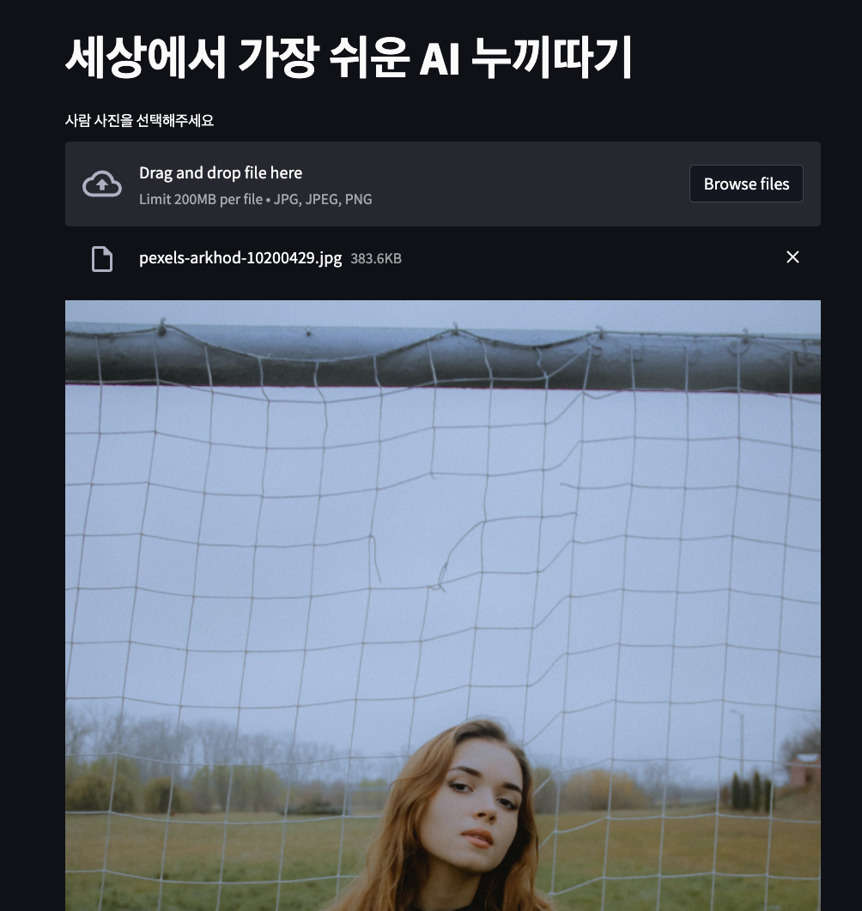
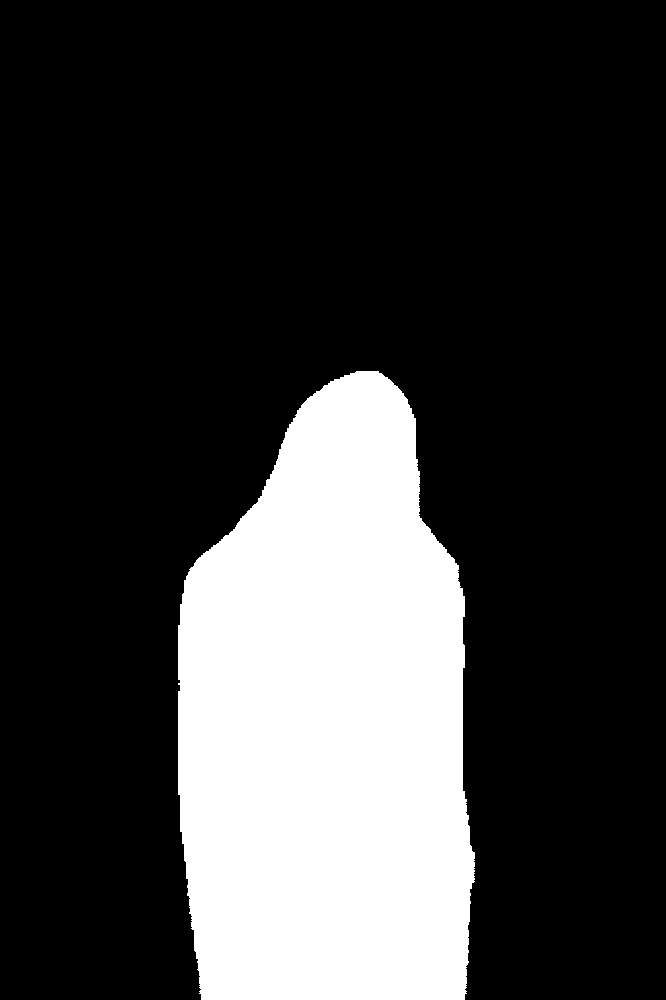
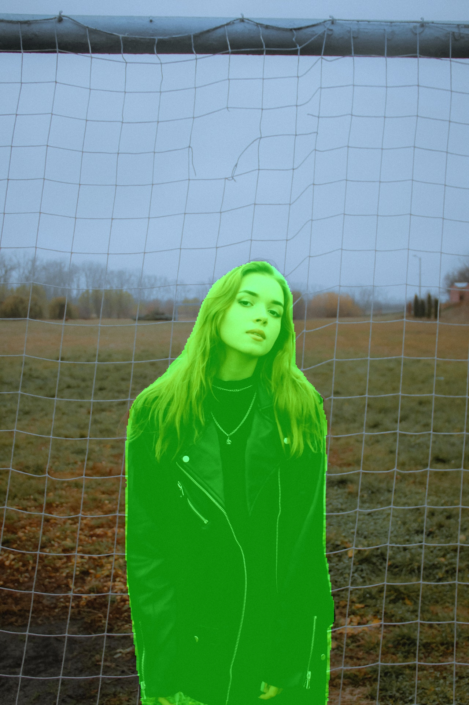

# Human Segmentation Demo

Streamlit demo for human segmentation(background removal) deep learning algorithm

| Original | Mask | Mask + Image | Result |
| - | - | - | - |
|  |  |  |  |

## Dependency

- Python 3
- OpenCV
- Numpy
- pytorch
- albumentations
- Pillow
- iglovikov_helper_functions
- people_segmentation
